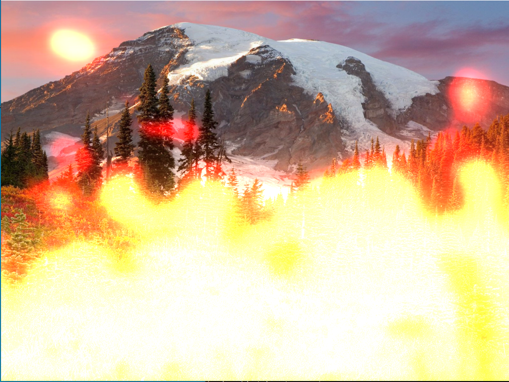

# PythonFireFx

<p align="center">
    
</p>


PythonFireFx is a shader for rendering 2D realistic fire effect (procedural fire).
Written in `python`, `cython` and `C` languages.It is design for 
`real time rendering` on pygame surface with screen resolution up
to `1280 x 1024 pixels`. 

Compatible with image format 24-32 bit with any of the following extension:
BMP, GIF (non - animated), JPEG, PNG image format.

It was originally designed for 2D video games application build on
top of Pygame library, but it can also be used as a plugin for 
`video` or `webcam special effect`. It requires few libraries in order 
to work, please see the dependency section for more details.

The algorithm has numerous options to control the fire envelop/aspect.
All this options can be defined as static or dynamic in order to 
produce a more realistic fire effect:

`Some of the options :` 
- Blur algorithm (to smooth and produce a warm /fluid fire effect)
- Palette (pre-defined color wavelength's values set in a numpy array)
- Smoothing effect to add a realistic touch
- Fire intensity to control the fire energy at the base
- Bloom effect to create local flickering light effect or add texture 
  volume to the fire (depends on the bright pass filter value) 
- Brightness control (fine control that change 
  the fire volume and intensity)
- The palette can be disregarded, and a default palette can be used with 
  colors defined by HSL (hue, saturation and luminescence values) that can 
  also be set dynamically to change the colors overtime
- Border flames (option to burn only the side of the screen/texture). This 
  option is designed to work with symmetrical surface (same width and height)

## Tested under windows x64 platform.

 * Please feel free to open a new ticket if you wish to add any suggestion(s) or 
   if you wish to report a bug.

## python method hook

```python
shader_fire_effect(
        width_,
        height_,
        factor_,
        palette_,
        fire_
)
```
`Optional arguments`
```python
        reduce_factor_        = 3,
        fire_intensity_       = 32,
        smooth_               = True,
        bloom_                = True,
        fast_bloom_           = True,
        bpf_threshold_        = 0,
        low_                  = 0,
        high_                 = 600,
        brightness_           = True,
        brightness_intensity_ = 0.15,
        surface_              = None,
        adjust_palette_       = False,
        hsl_                  = (10, 80, 1.8),
        transpose_            = False,
        border_               = False,
        blur_                 = True
```

## doc 
`Read the Documentation in the folder Doc/html/index.html`



## Demo

In the main directory run the below command 

`(press ESC to quit the demo)`

```commandline
C:\>python demo_fire.py
```

The project is under the `GNU GENERAL PUBLIC LICENSE Version 3`

## Installation 
check the link for newest version https://pypi.org/project/PythonFireFx/

* Available python build 3.6, 3.7, 3.8, 3.9, 3.10 and source build
```
pip install PythonFireFx 
```

`Building project from source`
```commandline
python setup.py build
python setup.py install
```

## Building cython code

#### When do you need to compile the cython code ? 

Each time you are modifying any of the following files 
FireFx.pyx, FireFx.pxd, __init__.pxd or any external C code if applicable

1) open a terminal window
2) Go in the main project directory where (FireFx.pyx & 
   FireFx.pxd files are located)
3) run : `C:\>python setup_FireFx.py build_ext --inplace --force`

If you have to compile the code with a specific python 
version, make sure to reference the right python version 
in (`python38 setup_FireFx.py build_ext --inplace`)

If the compilation fail, refers to the requirement section and 
make sure cython and a C-compiler are correctly install on your
 system.
- A compiler such visual studio, MSVC, CGYWIN setup correctly on 
  your system.
  - a C compiler for windows (Visual Studio, MinGW etc) install 
  on your system and linked to your windows environment.
  Note that some adjustment might be needed once a compiler is 
  install on your system, refer to external documentation or 
  tutorial in order to setup this process.e.g https://devblogs.
  microsoft.com/python/unable-to-find-vcvarsall-bat/

## OPENMP 
In the main project directory, locate the file ```setup_FireFx.py```.
The compilation flag /openmp is used by default.
To override the OPENMP feature and disable the multi-processing remove the flag ```/openmp```

####
```setup_FireFx.py```
```python

extra_compile_args = ["/openmp", "/Qpar", "/fp:fast", "/O2", "/Oy", "/Ot"]
```
Save the change and build the cython code with the following instruction:

```python setup_FireFx.py build_ext --inplace --force```

If the project build successfully, the compilation will end up with the following lines
```
Generating code
Finished generating code
```
If you have any compilation error refer to the section ```Building cython code```, make sure 
your system has the following program & libraries installed. Check also that the code is not 
running in a different thread.  
- Pygame version > 3
- numpy >= 1.18
- cython >=0.29.21 (C extension for python) 
- A C compiler for windows (Visual Studio, MinGW etc)

## Credit
Yoann Berenguer 

## Dependencies :
```
numpy >= 1.18
pygame >=2.0.0
cython >=0.29.21
```

## License :

GNU GENERAL PUBLIC LICENSE Version 3

Copyright (c) 2019 Yoann Berenguer

Copyright (C) 2007 Free Software Foundation, Inc. <https://fsf.org/>
Everyone is permitted to copy and distribute verbatim copies
of this license document, but changing it is not allowed.


